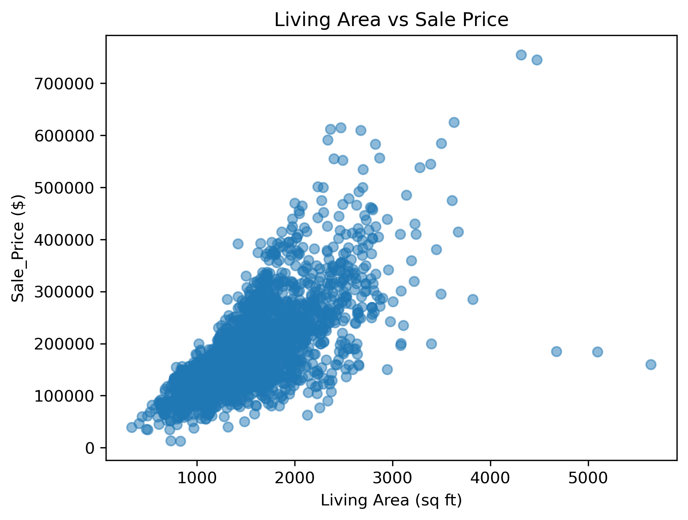
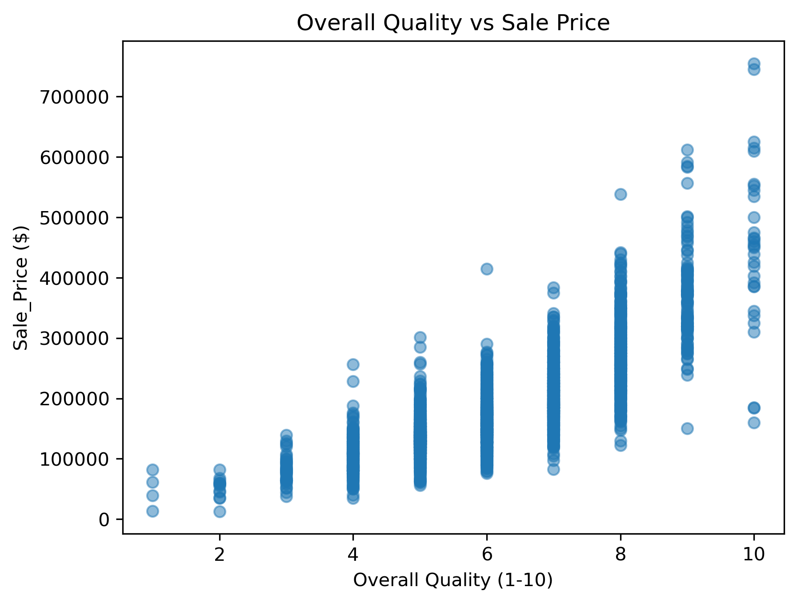
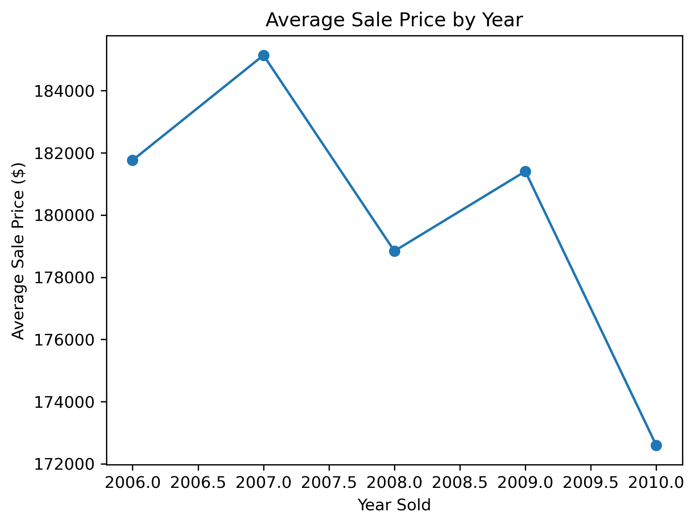
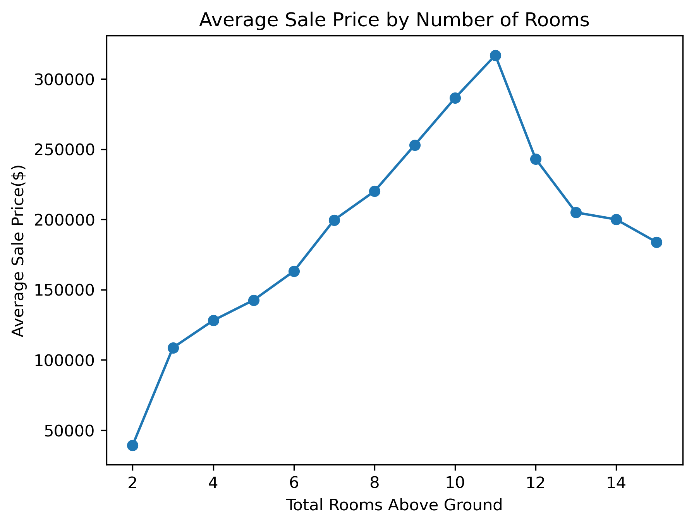

# 🏡 Ames Housing Price Analysis

## 📌 Project Overview
This project provides an in-depth analysis of the **Ames Housing Dataset** to investigate the key factors that drive residential property sale prices. 

The end-to-end workflow covers data cleaning, feature engineering, exploratory data analysis (EDA), statistical visualization, and relational database querying using SQLite and Python.

---

## 🛠️ Tools & Technologies
- **Language:** Python 3.x
- **Data Manipulation:** Pandas, NumPy
- **Data Visualization:** Matplotlib
- **Database & Querying:** SQLite3, SQL
- **Environment:** Jupyter Notebook, Git & GitHub

---

## 🔄 Project Workflow

### 1. Data Loading & Initial Inspection
The dataset was loaded using Pandas to assess shape, column types, missing values, distribution anomalies, and baseline summary statistics.

### 2. Data Cleaning
- Handled missing values based on domain logic (e.g., categorical missingness indicating absence of a feature like garages or pools was imputed as `'None'`).
- Identified and resolved duplicate records and inconsistent data formats.
- Audited impossible chronological records (e.g., sale years occurring prior to construction years).

### 3. Feature Engineering
Engineered informative domain-specific features to uncover hidden patterns:
- `House_age`: Property age at the time of sale.
- `Price_Per_Sq_Ft`: Sale price divided by above-ground living area.
- `Overall_Qual_Num`: Numeric mapping of property build quality.
- `Luxury_House`: Indicator for high-end properties (Quality Score $\ge 8$).
- `Price_Category`: Categorical bins for price segments.
- `Total_Bathrooms`: Combined metric of full and half bathrooms.
- `Is_Renovated`: Flag identifying properties remodeled after initial construction.

---

## 📊 Exploratory Data Analysis & Visualizations

The analysis investigated direct relationships between property characteristics and market valuations:

### 1. Living Area vs Sale Price
Examining how above-ground living space impacts the final transaction value:

### 2. Overall Quality vs Sale Price
Evaluating the strong correlation between construction quality and property valuation:

### 3. Average Sale Price Trend by Year
Tracking real estate price trajectory over recorded transaction years:

### 4. Room Count Impact on Sale Price
Analyzing the non-linear relationship between total rooms above ground and sale price:

---

## 🔍 Outlier & Inconsistency Analysis
- Examined extreme price-per-square-foot anomalies on both ends of the distribution.
- Investigated records with anomalous construction vs. sale timelines, determining appropriate handling rather than arbitrarily dropping data points.

---

## 🗄️ SQL Analysis
The cleaned tabular data was migrated into an in-memory / local **SQLite database** to execute structured queries, answering business-level questions such as:
- Top neighborhoods ranked by average transaction value.
- Highest-value properties across distinct building classes.
- Undervalued properties exhibiting high overall build quality.

---

## 💡 Key Insights
- **Quality Dominance:** `Overall Quality` demonstrates the strongest positive correlation with property sale prices.
- **Living Area Scaling:** Square footage is a consistent primary driver of price, with notable luxury outliers.
- **Neighborhood Divergence:** Significant price variance exists across neighborhoods, indicating strong location premium.
- **Diminishing Returns on Rooms:** Price scales positively with room count up to a threshold, after which variance increases significantly.

---

## 🎯 Conclusion
This project demonstrates a complete, production-grade data analysis pipeline: from raw data profiling, systematic cleaning, and feature engineering to graphical exploration, anomaly detection, and SQL querying.

---

## 👤 Author
**Zahra Ahmadi**  
- **GitHub:** [zahraahmadi9700](https://github.com/zahraahmadi9700)